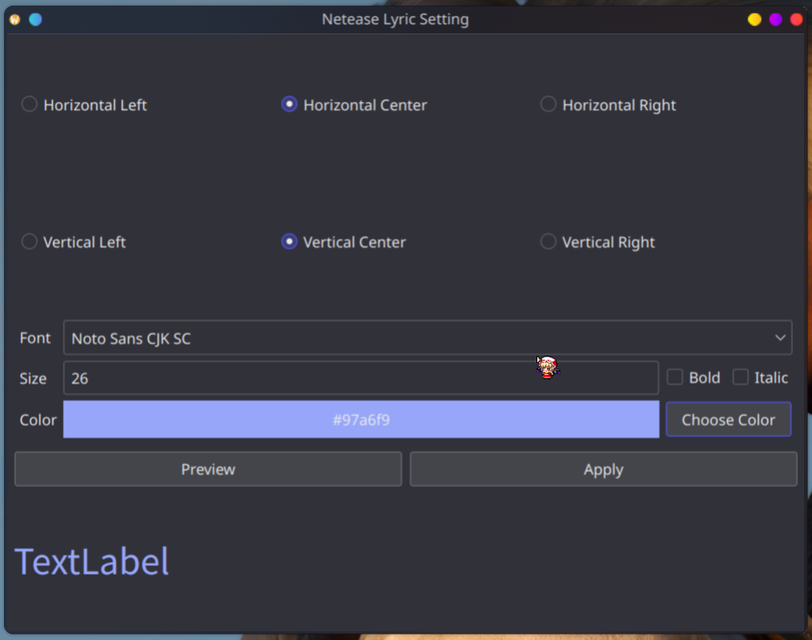

## Netease-Lyric

本程序基于细微修改后的[go-musicfox](https://github.com/go-musicfox/go-musicfox)项目上，
使得能够在Linux KDE Plasma6桌面上显示歌词。

需要依靠KDE Plasma修改窗口大小和移动。

### 构建

前置需求：[go-musicfox](https://github.com/go-musicfox/go-musicfox)项目所需需求以外还需要QT5或者QT6。

```
clone https://github.com/SmileYik/linux-netease-lyric.git
cd netease-lyric
cmake -S . -B build
cd build
make
```

构建过程中会拉取[go-musicfox](https://github.com/go-musicfox/go-musicfox)并应用补丁后进行编译出修改版本。位置在`go-musicfox/bin`下

### 效果




