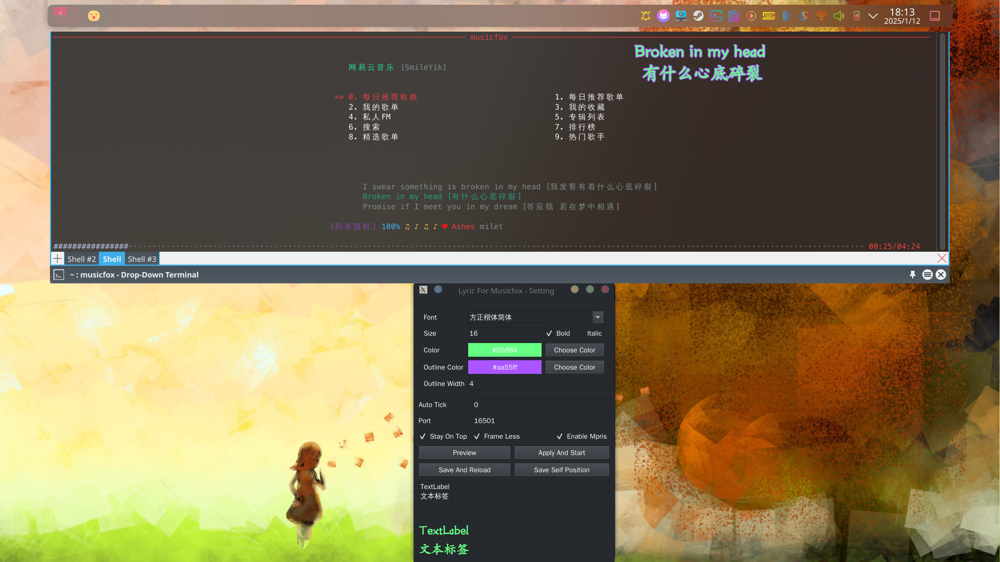

## Lyric For Musicfox

本程序基于细微修改后的[go-musicfox](https://github.com/go-musicfox/go-musicfox)项目上，
使得能够在Linux KDE Plasma6桌面上显示歌词。

如果鼠标事件无法正常穿透则使用 `-platform xcb` 参数尝试启动，即 `./lyric-for-musicfox -platform xcb`。

### 构建

前置需求：[go-musicfox](https://github.com/go-musicfox/go-musicfox)项目所需需求以外还需要QT5或者QT6。

```
clone https://github.com/SmileYik/lyric-for-musicfox.git
cd netease-lyric
cmake -S . -B build
cd build
make
```

构建过程中会拉取[go-musicfox](https://github.com/go-musicfox/go-musicfox)并应用补丁后进行编译出修改版本。位置在`go-musicfox/bin`下

### 配置歌词


首次运行时将会自动弹出配置窗口，若非首次运行，则需要加上参数`setting`才能打开此设定窗口（例如`./lyric-for-musicfox setting`）。

* 1: 设定字体。
* 2: 设定字体大小。
* 3: 设置文本颜色。
* 4: 设定窗口是否置顶，该复选框仅会发送设定信号至正在运行的歌词窗口，即复选该框需要歌词窗口正在运行。
* 5: 设定窗口是否带有边框，该复选框仅会发送设定信号至正在运行的歌词窗口，即复选该框需要歌词窗口正在运行。
* 6: 在下方预览设定好的字体、字体大小和颜色。
* 7: 保存配置并且打开歌词窗口。
* 8: 保存设置并且发送重载配置信号至正在运行的歌词窗口，即需要歌词窗口正在运行。
* 9: 发送保存信号至正在运行的歌词窗口，让其保存自己所在的位置信息、窗口大小和字体信息。

设定建议：首先打开一个歌词窗口，与此同时打开设定窗口。在设定窗口中设置好需要的字体、文本颜色和字体大小，并让现有歌词窗口进行重载。
取消勾选“Frame Less”复选框，以显示歌词窗口边框，此时对歌词窗口进行移位或调整窗口大小。当认为合适时，勾选上“Frame Less”复选框，
与此同时，按下“Save Self Position”按钮进行保存相关信息。之后直接不保存配置，并关闭设定窗口，到此设置完毕。

### 效果


