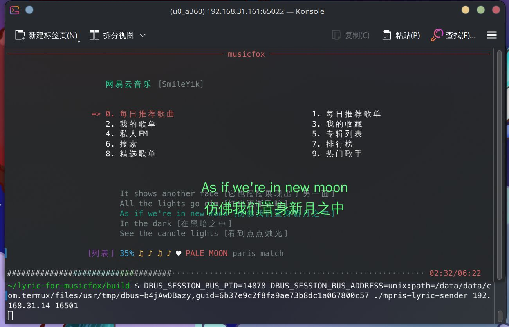

# Lyric For Musicfox

本程序基于细微修改后的[go-musicfox](https://github.com/go-musicfox/go-musicfox)项目上，
使得能够在Linux KDE Plasma6桌面上显示歌词。若您的设备运行着 Linux，则可以在设置界面中勾选上
Mpris 模式并保存，而免于运行打补丁的 musicfox。

如果鼠标事件无法正常穿透则使用 `-platform xcb` 参数尝试启动，即 `./lyric-for-musicfox -platform xcb`。
WINDOWS 下运行会出现无法移动窗口现象，需要改配置文件+反复开关歌词程序以确定位置。

## 构建

### 利用 Github Action 构建

直接 folk 一份仓库后，等待 action 跑完后可以在 action 下下载构建好的二进制包。

### 自己动手构建

前置需求：[go-musicfox](https://github.com/go-musicfox/go-musicfox)项目所需需求以外还需要：

* QT5 或 QT6
* libdbus-1 (仅Linux下构建才需要)

```shell
clone https://github.com/SmileYik/lyric-for-musicfox.git
cd lyric-for-musicfox
cmake -S . -B build
cd build
make
```

CMake 配置时可选编译打补丁的musicfox。

```shell
cmake -S . -B build -DSKIP_BUILD_MUSICFOX=YES # 跳过构建 musicfox
cmake -S . -B build -DSKIP_BUILD_MUSICFOX=NO  # 构建 musicfox
```

构建过程中会拉取[go-musicfox](https://github.com/go-musicfox/go-musicfox)并应用补丁后进行编译出修改版本。位置在`go-musicfox/bin`下

可选修改歌词通信端口：打开 `CMakeLists.txt` 修改 `CONFIG_PORT` 为自己想要的通信端口后进行编译即可。
若编译过程中出现打补丁失败字样可以自行文本修改`musicfox.patch`中`${CONFIG_PORT}`至想要的端口后手动打补丁编译。

## 运行模式

现有两种运行模式，一种需要运行修改后的 go-musicfox，另一种依赖于 mpris，并且从其中获取歌词。  

但两种运行模式都有共同点，就是歌词程序会监听一个UDP端口，该UDP端口用于接收歌词与相关指令信息，之后在窗口中渲染出来。

### 修改 go-musicfox 的运行模式

该模式支持 Linux 及 Windows 平台。主要依赖于修改后的 go-musicfox 客户端。修改后的 go-musicfox 客户端在
更新歌词时，都会通过 UDP 协议，发送当前当句歌词信息给桌面歌词程序，然后桌面歌词程序再进行窗口渲染，将歌词文本
渲染在窗口中。在该模式下，桌面歌词程序并不知道完整的歌词信息，仅知道当前时间下的单句歌词文本信息。若歌词超过了
窗口的最大宽度，则需要进行滚动展示歌词，但是由于不知道当前歌词的持续的具体时间，所以需要依赖于 go-musicfox 发送
歌词的频率: 每多发一次相同歌词，就将当前显示的歌词滚动固定偏移量一次。

大概工作流程为： 修改后的go-musicfox --发送歌词--> lyric-for-musicfox

### 依赖于 mpris 的运行模式

该模式仅支持 Linux, 可以在设定界面中启用设置，若您的设备为 Windows，则在编译时会自动剔除 mpris 相关的代码。
启用该模式后，桌面歌词会启用 mpris 控制器，从 mpris 中获取当前播放歌曲信息及完整的歌词信息，并模拟时间轴，推算
当前时间点应该显示的歌词，通过 UDP 报文发送至渲染端。相当于启动了一个新的控制器用于顶替修改后的 go-musicfox 客
户端功能。

大概工作流程为：go-musicfox --更新歌词及播放状态--> mpris --获取信息--> lyric-for-musicfox 的 mpris 控制器 --发送歌词--> lyric-for-musicfox.

对于 lyric-for-musicfox 的 mpris 控制器，可以单独运行，并指定歌词发送的目的地IP和目的地的端口。假如您正在使用
 termux 版本的 go-musicfox, 可以单独运行 mpris 控制器，将歌词发送至同一网络下的 PC 桌面设备，进行歌词渲染。
具体效果如下图：



## 配置


首次运行时将会自动弹出配置窗口，若非首次运行，则需要加上参数`setting`才能打开此设定窗口（例如`./lyric-for-musicfox setting`）。

* 1: 设定字体。
* 2: 设定字体大小。
* 3: 设置文本颜色。
* 4: 设定窗口是否置顶，该复选框仅会发送设定信号至正在运行的歌词窗口，即复选该框需要歌词窗口正在运行。
* 5: 设定窗口是否带有边框，该复选框仅会发送设定信号至正在运行的歌词窗口，即复选该框需要歌词窗口正在运行。
* 6: 在下方预览设定好的字体、字体大小和颜色。
* 7: 保存配置并且打开歌词窗口。
* 8: 保存设置并且发送重载配置信号至正在运行的歌词窗口，即需要歌词窗口正在运行。
* 9: 发送保存信号至正在运行的歌词窗口，让其保存自己所在的位置信息、窗口大小和字体信息。

设定建议：首先打开一个歌词窗口，与此同时打开设定窗口。在设定窗口中设置好需要的字体、文本颜色和字体大小，并让现有歌词窗口进行重载。
取消勾选“Frame Less”复选框，以显示歌词窗口边框，此时对歌词窗口进行移位或调整窗口大小。当认为合适时，勾选上“Frame Less”复选框，
与此同时，按下“Save Self Position”按钮进行保存相关信息。之后直接不保存配置，并关闭设定窗口，到此设置完毕。

## 效果


